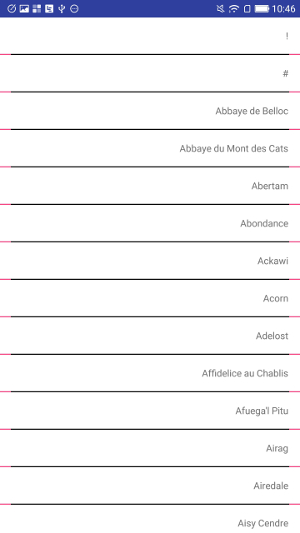

### ListView分割线
   ListView、Preference（ListView）的分割线在dispatchDraw中通过canvas画出。当ListView的背景色和Item的背景
色不一致时，如果通过android:list配置 **左右有padding的分割线**，这时候会出现分割线padding的空隙为ListView
的背景色。如下图，ListView的背景色为粉红色，Item的背景为白色，分割线为黑色，出现了左右间隙为红色，影响视觉



这边有两个方法可以避免这种现象：

* 将分割线的padding颜色设置为和Item一样的颜色

```
 DividerDrawableFilter filter = new DividerDrawableFilter() {

    /**分割线的颜色
     * @return the divider color,default value is 0xffc6c7cb.
     */
    public int dividerColor() {
        return 0xffc6c7cb;
    }

    /**
     *分割线padding的颜色，推荐和listview中的item的背景色一致，或者返回为0
     * @return the padding space color,default value is 0xffffffff.
     *         Advise return the item color
     */
    public int dividerPaddingColor() {
        return 0xffffffff;
    }

    /**分割线距离左边的距离
     * @return the left space width dp,default value is 16.
     */
    public int leftDividerMargin() {
        return 16;
    }

    /**分割线距离右边的距离
     * @return the right space width dp,default value is 16.
     */
    public int rightDividerMargin() {
        return 16;
    }

    /**分割线的高度
     * @return the divider height px,default value is 1.
     */
    public int dividerHeight() {
        return 1;
    }};
    Drawable divider = DividerUtils.packageDividerDrawable(context,filter);
    ListView.setDivider(divider);
```

* 不用android:divider,每个Item包含一个Divider View

```
  <declare-styleable name="DividerView">
      <attr name="android:background"/>                                //分割线的背景，默认为透明
      <attr name="dividerLeft" format="dimension|reference"/>            //分割线距离左边的距离,默认为0
      <attr name="dividerRight" format="dimension|reference"/>         //分割线距离右边的距离，默认为0
      <attr name="dividerPaddingColor" format="color|reference"/>      //分割线padding的颜色 ，默认为透明
  </declare-styleable>

  //代码中设置分割线
  DividerView view = (DividerView) findViewById(R.id.divider);

  view.setDividerDrawableFilter(new DividerDrawableFilter() {
      /**
       * @return the divider color,default value is 0xffc6c7cb.
       */
      public int dividerColor() {
          return 0xffc6c7cb;
      }

      /**
       *
       * @return the padding space color,default value is 0xffffffff.
       *         Advise return the item color
       */
      public int dividerPaddingColor() {
          return 0xffffffff;
      }

      /**
       * @return the left space width dp,default value is 16.
       */
      public int leftDividerMargin() {
          return 15;
      }

      /**
       * @return the right space width dp,default value is 16.
       */
      public int rightDividerMargin() {
          return 15;
      }

      /**
       * @return the divider height px,default value is 1.
       */
      public int dividerHeight() {
          return 1;
      }
  });
```

### RecyclerView分割线
RecyclerView对分割线做了补充，可以通过设置RecyclerView.ItemDecoration

```

DividerItemDecoration dividerItemDecoration = new DividerItemDecoration(getContext());

//注意：setDividerFilter需要自定义样式时使用，不设置时，默认提供统一样式。
/*dividerItemDecoration.setDividerFilter(new DividerFilter() {

    //是否显示底部分割线
    @Override
    public boolean bottomDividerEnabled() {
        return false;
    }

    //是否显示分割线，需要应用逻辑判断
    @Override
    public boolean dividerEnabled(int position) {
        return false;
    }

    //分割线左边距离
    @Override
    public int leftDividerMargin(int position) {
        return 0;
    }
    //分割线右边距离
    @Override
    public int rightDividerMargin(int position) {
        return 0;
    }
    //分割线颜色
    @Override
    public int dividerColor() {
        return 0;
    }
});*/

RecyclerView.addItemDecoration(dividerItemDecoration);

```
### Preference分割线
Preference的分割线有两种,取决于底层使用的是ListView（framework的Preference使用）还是用
RecyclerView(support v7/v14使用的是RecyclerView)
ListView和RecyclerView的分割线在上面已经介绍了。
使用Preference可能会遇到控制分割线某个位置不显示，这时候可以通过DividerFilter#dividerEnabled中的position
判断是否显示分割线。

